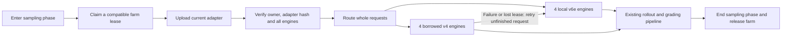

# Borrowing inference capacity during RL sampling

**Follow-up, September 20:** the first round finished with all 512 completions
returned, but all four borrowed requests were cancelled by the client's strict
heartbeat-readiness check and regenerated locally. Total inference response
time was **45 minutes 27 seconds**, including retries. The throughput snapshot
below remains a measurement of active decoding, not a successful borrowing
speedup. A consumer fix now distinguishes temporary health uncertainty from
lease/adapter loss; its tests are described in the
[protocol guide](../tpu/swarm/ray_train/INFERENCE_BORROWING.md). It has not been
deployed to job 1270.

Qwen circuit job **1270** successfully acquired an external inference farm,
loaded its current LoRA adapter, and generated tokens on local v6e and borrowed
v4 engines simultaneously. In the recorded snapshot, four borrowed engines
contributed **1,599.9 generation tokens/s** alongside **2,432.9 tokens/s** from
four local engines: **4,032.8 tokens/s combined**, or **65.8% additional observed
decoding throughput** relative to the local engines' simultaneous contribution.

This is an integration result and a throughput snapshot. It is not yet a
measurement of complete sampling-round or optimizer-step speedup.

## Why borrow capacity?

An RL job needs inference capacity during sampling and trainer capacity during
updates. An already loaded inference farm can temporarily serve the job's
adapter, increasing sampling capacity without moving its trainer or reserving
that farm for the entire training run. Other jobs using the same base model can
borrow the farm during later sampling phases.

The current design permits **one active adapter per farm**. It does not depend
on concurrent serving of different adapters, whose numerical issue remains
unresolved in the separate serving experiment.

## How the integration works

The client enters a sampling-phase context, and the local ingress attempts to
claim one configured compatible service. It uploads the committed adapter and
checks its SHA-256 and readiness across all four external engines before routing
requests there. Both paths use the same adapter artifact, native thinking-budget
contract, and sampling payload. Whole `n=32` requests are routed; their samples
are not split across the local and remote farms by this client.

The router compares active requests per engine and caps the external farm at
four concurrent requests. Heartbeats renew the farm lease; a separate client
heartbeat bounds ownership if the training client disappears. An unavailable
farm leaves the local path usable. Failed or unfinished remote requests fall
back to local inference; a matching phase release drains outstanding work and
relinquishes the farm. These failure paths have focused test coverage, but were
not deliberately triggered in this live training trial.

The hook is optional and does not change GRPO. It currently supports the
single-adapter pipelined sampling boundary. Code:
[client phase hook](../tpu/swarm/ray_train/borrowing_phase.py) and
[lease and routing client](../tpu/swarm/ray_train/borrowing.py).

## Experiment and measurements

| Setting | Trial configuration |
| --- | --- |
| Training workload | Qwen3.5-27B, circuit optimization, GRPO |
| Training job / worker | 1270 / v6e worker 5143 |
| Trainer | Four hosts, TP8 / FSDP2, LoRA rank 32 |
| Local inference | Four TP4 engines, 16 active sequences per engine |
| Borrowed inference | Qwen farm job 1251 / v4-32 worker 173, four TP4 engines |
| Sampling batch | 16 groups × 32 completions = 512 |
| Token limits | 16,384 prompt-plus-thinking allowance; 22,528 total context |
| Circuit evaluation | CPU, 17 IBM cases, pinned Xplace starts and fast C helper |
| Initialization | Fresh model/optimizer; no bootstrap seed pool |

The snapshot spans **2026-09-20 00:37:37–00:37:42 UTC** (September 19,
20:37 EDT). These are vLLM's per-engine interval averages, collected within a
five-second window, not synchronized lifetime counters or a repeated benchmark.

| Capacity | Per-engine generation tokens/s | Combined tokens/s | Active sequences |
| --- | --- | ---: | ---: |
| Local v6e | 606.3, 607.8, 607.9, 610.9 | 2,432.9 | 64 |
| Borrowed v4 | 400.0, 399.9, 400.0, 400.0 | 1,599.9 | 64 |
| Total | Eight engines | 4,032.8 | 128 |

The relative contribution is `1599.9 / 2432.9 = 65.76%`. This is not a paired
local-only experiment: borrowing changes queues and work distribution. Local
prefix caching was enabled (approximately 98.3% hit rate in this snapshot),
whereas the borrowed farm had it disabled. Hardware generations also differ.
Neither the rates nor the speed ratio isolate a hardware effect.

Local adapter commit to external `borrow_ready` took **20.90 seconds**. This
interval includes the gap between those events and remote preparation; it is
not an isolated upload benchmark. The adapter archive was **637,624,320 bytes**,
and the local and external readiness events attest the same SHA-256:
`2cafa1411255a382f24eb2df10fa7afd27749b54e7614a2577aaf99c8871c783`.

## What has and has not been established

The live run establishes lease acquisition, adapter identity verification,
four-engine remote readiness, and concurrent token generation on eight engines.
A separate short preflight completed 128 outputs with token/logprob/mask,
finiteness, and native-budget checks; those used a 64-token output cap and do
not establish full-length rollout performance.

At the event capture on **2026-09-20 00:40:33 UTC**, there were no
`borrow_generated` events yet. No full borrowed 32-sample response or completed
optimizer step had been verified. The current interface returns a group only
after all of its completions finish; active token generation can precede a
returned group by many minutes. Successful release after this real sampling
phase, local fallback under a live outage, full-length output correctness, and
training-quality equivalence remain unverified.

The next measurements should record returned groups and completion lengths,
first and last grading times, sampling-phase end and lease release, and the
first completed optimizer step. A matched local-only comparison is needed to
claim end-to-end speedup. Tail latency, unequal engine speeds, CPU grading,
adapter transfer, and compilation can all reduce the benefit of added decoding
capacity. In this run SkyPilot handoff alone took **667.71 seconds**, before
workload setup and inference compilation; that startup cost is separate from
the steady-state snapshot above.

## Evidence

At **00:55:15 UTC**, renewal returned HTTP 200 after **5.014 seconds**, followed
by `borrow_heartbeat_failed` and four `borrow_generation_failed` events. The farm
retained the same owner and adapter and subsequently reported 4/4 ready without
engine restarts. A five-second engine probe timeout is the leading explanation;
the original client logged only the exception class, so the failing response
body and exact probe are not available. The new consumer logs safe diagnostic
fields, pauses new requests, and allows a fixed 90-second recovery interval for
already admitted requests. Confirmed identity loss or deadline expiry still
invalidates them. All 16 group responses returned between request start
**00:24:51.986 UTC** and final response **01:10:19.423 UTC**. This establishes
local fallback completion, not successful delivery of borrowed full-length groups.

- [Exact engine log lines and throughput arithmetic](../tpu/science/results/inference-borrowing-qwen-20260919/fix1/throughput-snapshot.json)
- [Adapter commit and external readiness events](../tpu/science/results/inference-borrowing-qwen-20260919/fix1/live-events.json)
- [Submission identity and immutable bundle checksum](../tpu/science/results/inference-borrowing-qwen-20260919/fix1/submission.json)
- [Full configuration, short preflight and packaging regression](../tpu/science/results/inference-borrowing-qwen-20260919/README.md)

The original job 1262 failed before workload startup because it used an
incomplete generic package. Commit `4989efb6` makes the public builder select
the science packager automatically and adds an extracted-artifact import test.
Job 1270 uses that corrected bundle. This deployment issue is separate from the
borrowing protocol and is retained in the experiment record.
