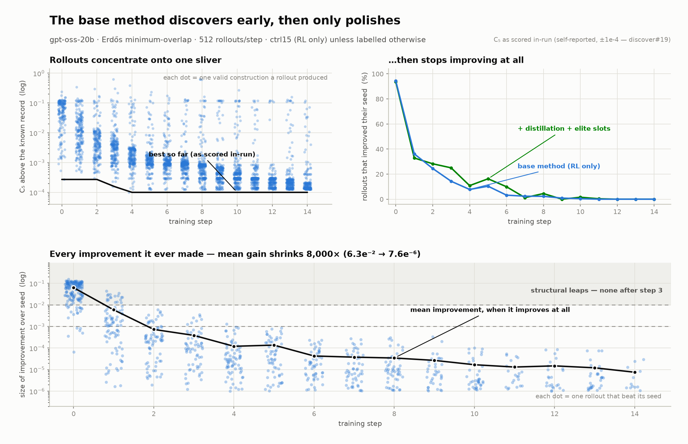

# Context-Distillation A/B on ttt-discover Erdős (gpt-oss-20b): Full Behavioral Analysis

Two 15-step runs, identical canonical config (gpt_oss_high_reasoning, 8×64=512
rollouts/step, lr 4e-5, KL 0.1, EVAL_TIMEOUT=1100, SAVE_EVERY=0), July 10–11 2026:

- **ctrl15** — RL only (wandb `erdos-gptoss20b-ctrl15`, run dir `runs/ttd_gptoss20b_ctrl15`)
- **distill15** — RL + contrastive context-distillation CE aux loss, β=0.1
  (`ttt_discover/rl/context_distill.py`; teacher = current policy, 16 pool-wide
  (worse, 2–3 betters) pairs/step, `<improve>`-block targets, citation-grounding +
  leak gates, final-channel-only CE accumulated into the same optim step)

Reference points (all c5 independently re-verified from constructions):
old 14-step 20b baseline 0.381472 · in-context contrast experiment 0.381182 ·
authors' published record 0.380932 (re-verifies to 0.380973 per discover#19) ·
**our gpt-oss-120b 20-step run 0.380887659** (`tpu/results/erdos-gptoss120b/`).

wandb (project `sk7524-princeton-university/ttt-discover-gptoss20b`):
- ctrl15: https://wandb.ai/sk7524-princeton-university/ttt-discover-gptoss20b/runs/xkil7ddh
- distill15: https://wandb.ai/sk7524-princeton-university/ttt-discover-gptoss20b/runs/8gsb0c0d
- distelite15 (follow-up, in flight): https://wandb.ai/sk7524-princeton-university/ttt-discover-gptoss20b/runs/jhucnrgk
- original 14-step baseline: https://wandb.ai/sk7524-princeton-university/ttt-discover-gptoss20b/runs/e5vkjxyc
- gpt-oss-120b record run: https://wandb.ai/sk7524-princeton-university/ttt-discover-gptoss20b/runs/74zeiufa

## 0. The picture

*(regenerate: `uv run --isolated --with matplotlib --with numpy python
tpu/results/erdos-distill-ab/make_search_dynamics.py`)*

Left: every valid construction a ctrl15 rollout produced, as distance above the
known record — a cloud spanning four orders of magnitude at step 0 concentrates
onto a single sliver at ~1e-4 by step 14, and the in-run frontier stops moving
after step 4. Middle: the improve-rate collapse (94%→0%), with distelite15
overlaid — distillation delays it ~2 steps but does not change the asymptote.
Right/bottom: every improvement the base method ever made. **The mean gain,
among rollouts that improve at all, decays monotonically 8,000×** — 6.3e-2 at
step 0 to 7.6e-6 at step 14 — and no improvement exceeds 1e-2 after step 3.
Late "optimization" is polish, not discovery.

Mean improvement per step (ctrl15, improving rollouts only):

| step | 0 | 1 | 2 | 3 | 4 | 6 | 8 | 10 | 12 | 14 |
|---|---|---|---|---|---|---|---|---|---|---|
| mean gain | 6.3e-2 | 5.9e-3 | 7.3e-4 | 3.9e-4 | 1.2e-4 | 4.3e-5 | 3.5e-5 | 1.7e-5 | 1.5e-5 | 7.6e-6 |

## 1. Headline

| arm | best c5 (verified) | family | found at |
|---|---|---|---|
| ctrl15 | **0.381001033** | n=1000 | steps 13–14 |
| distill15 | 0.381039226 | n=400 | steps 12–14 |

Control won the frontier by 3.8e-5 — but via the *most converged* behavior in the
experiment (see §4), not via exploration. Distillation measurably preserved
exploration and lost the tail race on a 15-step horizon.

## 2. Improve-rate vs control (the exploration metric)

% of successful rollouts whose returned construction beat their seed by >1e-4
(succ ≈ 160–260/step in each cell; success rates near-identical between arms):

| step | ctrl imp% | distill imp% | ctrl tie% | distill tie% |
|---|---|---|---|---|
| 0 | 94.3 | 93.8 | 2.8 | 2.5 |
| 1 | 36.2 | 39.9 | 28.1 | 21.2 |
| 2 | 24.5 | 30.8 | 35.5 | 37.9 |
| 3 | 14.3 | **23.0** | 41.9 | 45.6 |
| 4 | 7.8 | **19.0** | 58.9 | 55.7 |
| 5 | 10.3 | **17.0** | 60.6 | 55.9 |
| 6 | 3.2 | **7.9** | 60.1 | 64.9 |
| 8 | 2.3 | 4.3 | 73.2 | 73.9 |
| 10 | 0.4 | 0.0 | 72.6 | 70.9 |
| 12 | 0.0 | 0.4 | 88.2 | 71.2 |
| 14 | 0.0 | 0.0 | 80.8 | 71.4 |

- Distill led at every step 1–9; pooled steps 7–14: **1.8% vs 0.8%** (32/1769 vs
  15/1890, p<0.01 treating rollouts as independent; note one replicate pair, so
  arm-level run variance is not fully excluded).
- Both arms collapsed to ~0% by step 10 — distillation **delayed the exploration
  collapse ~2 steps; it did not change the asymptote** (at β=0.1).
- No RL tax: success rate and reward/mean matched or slightly favored distill.
- Both arms collapse far faster than the old 300s-timeout baseline (21% improve
  at step 13 there): the 1100s budget converges the pool in ~5 steps, and
  exploration collapse tracks *pool convergence*, not step count.

## 3. Why the 2× improve-rate didn't buy the frontier

Pooled steps 3–14, successful rollouts:

| | n improvements | <1e-3 (micro) | 1e-3–1e-2 | >1e-2 | reached c5<0.3812 |
|---|---|---|---|---|---|
| ctrl15 | 91 | 83 | 8 | 0 | **12** |
| distill15 | **184** | 165 | 19 | 0 | 5 |

- **Improvements are micro-capped in both arms** (~90% <1e-3; zero >1e-2 after
  step 3). Structural leaps — the thing that made the original run's champion —
  are extinct in both. Grounded critique of an existing program is inherently
  incremental advice; distillation raised improvement *frequency*, not
  *magnitude*.
- Distill's improving code carries the taught advice signatures at higher rates
  (more-iterations 41% vs 27%, finer-grid 33% vs 18%): the distillation
  demonstrably transferred — and demonstrably capped itself.
- The ultra-tip (c5<0.3812) belonged to ctrl (12 vs 5 rollouts): all from one
  family it polished relentlessly (§4).

## 4. PUCT: deep-on-one vs wide-on-many (the central mechanism)

Seed allocation, steps 9–14 (~2940 rollouts/arm):

| seed band | ctrl15 | distill15 |
|---|---|---|
| elite (<0.38105) | **31.1%** | 3.3% |
| near (0.38105–0.3815) | 66.2% | 83.2% |
| mid (0.3815–0.383) | 2.7% | 13.6% |

Final-pool structure (constructions canonicalized to 256 pts, mirror-invariant;
leader clustering, ε=0.02 RMS):

| | pool clusters | top-20 clusters | top-20 value spread | tip-10 RMS (late) |
|---|---|---|---|---|
| ctrl15 | 168 | **1** (n=1000 ×20) | 0.381001…0.381001 | **0.0000** (identical) |
| distill15 | **243** | **7** (n=400/600/800) | 0.381039…0.381094 | 0.027–0.10 |

Mechanism (the clone-chain loophole): PUCT's exploitation is value-greedy over
*nodes*; visit penalties and lineage-blocking key on node identity. A family that
keeps producing micro-polished children mints fresh top-value node-ids faster
than exploration bonuses decay — ctrl entered this self-reinforcing loop at step
8 (31% of all rollouts → one family; top-10 literally identical constructions by
step 11). Distill's broad improvement *flattened the value landscape* (dozens of
branches within ~5e-5), diluting greedy mass 10–30× — its best family got 3.3%
of rollouts and never accumulated polish depth.

Same pathology, opposite masks, seen twice: the original run's champion (a
*static* peak) was diluted into a 933-state pool and **never resampled for 9
steps**; ctrl15's champion (a *regenerating* family) was **over-resampled**.
PUCT exploits *states that keep spawning slightly-better children*, not good
states per se.

Both pools funnel toward the near-optimal coarse shape (top-half homogeneity
0.35→low in both) — benign convergence-to-optimum — but ctrl's funnel ends in a
single point, distill's in a cloud ~10× wider at every scale. **Control did not
retain diversity; over-exploitation destroyed it.** Distill's endstate = a
diversified portfolio of 7 near-frontier families, uncashed; ctrl's = one
family, fully cashed, whose floor happened to be 4e-5 lower.

## 5. Distill-loss behavior and internalization

`distill/ce_mean_nll` per step: 1.02 .72 .97 .84 .98 .86 .83 1.07 1.03 .96 .94
.95 **.74 .69 .77** — flat ~0.93 for 12 steps, dip in the last 3.

Stereotypy confound tested and disfavored: the pool homogenized at **step 10**
(top-half RMS 0.27→0.07) but NLL stayed high through step 11 and dipped at 12;
critiques got ~40% *longer* (740→1100 tok) at the dip, not shorter/templated.
Consistent with slow real internalization finally surfacing — though possibly
*narrow* (fitting critiques of the converged pool); resolving that requires the
frozen-probe metric (implemented post-hoc: `distill/probe_nll`).

Dose interpretation ("homeopathic" corrected): Adam is per-parameter
scale-invariant, so the tiny CE term acts at ~full strength in RL-quiet
directions (explaining real behavior shift with no policy/frontier shift) and is
crushed on RL-contested weights. β moves the contested boundary, not overall
potency.

Machinery health across the run: 16 pairs/step selected; 4–11 datums surviving
gates; leak-drops noisy 2–10 (no trend); teacher pass 100–210s/step (~3% of step
wall-clock); zero `<improve>` format bleed into rollouts in either arm.

## 6. Prior context these runs build on

- **Trace analysis of the original 14-step run** (~4,900 full reasoning traces):
  reasoning degeneration under max-RL — improve-rate 85%→21%, ties→58%,
  hard-seed improvement ability 40%→5%; late thinking same length/vocabulary but
  decoupled from action; all frontier finds from early exploration; reward
  geometry (fail-vs-valid gap ≈600× the quality range) as the driver.
- **Feedback-style A/B (6 arms, `runs/critic_ab/`)**: full diagnostic critic →
  validity ×2, exploration →0; lean 2-sentence notes → most improvements; idea
  suggestions → marginal; exhortation → null; **contrastive gap-explanation →
  best (0.381182), transfers principles without code**. That result motivated
  the distillation objective.

## 7. Conclusions and follow-ups

1. The distillation mechanism works (behavioral transfer, no RL cost) but at
   β=0.1 with a self-teacher and converged-pool pairs it teaches *polishing*,
   whose value the sampler then failed to concentrate.
2. The frontier race at this stage is a **depth allocation game**; the sampler,
   not the objective, decided the winner.
3. Implemented follow-ups (commit `0ca82be`, all default-off):
   `TTD_ELITE_SLOTS` (value-greedy elite seeds, one per lineage — converts width
   into guaranteed depth), `TTD_DISTILL_TEACHER_MODEL` (frozen stronger teacher,
   e.g. gpt-oss-120b), `distill/probe_nll` (frozen-probe internalization
   metric).
4. Experiment queue (user's decision tree): **distill+`TTD_ELITE_SLOTS=8`**
   (launched as `erdos-gptoss20b-distelite15`); if insufficient → β 0.1→0.2, or
   reevaluate contrastive-pair sampling (max-gap anchoring).

Analysis scripts: conversation-session scratchpad (`compare_reasoning.py`,
`why_no_frontier.py`, clustering/homogeneity snippets operate on the wandb
`gen&score_train_*` tables + `puct_sampler_step_*.json` buffers in each run dir).
