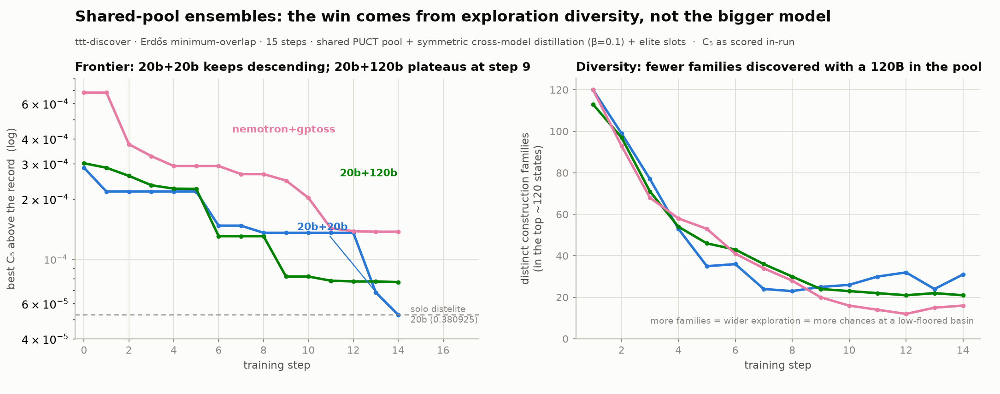

# Shared-pool ensemble discovery on ttt-discover Erdős: three runs

Do two models sharing one PUCT archive discover better minimum-overlap
constructions than one model alone? Three 15-step ensembles say: **the shared
archive genuinely cross-pollinates, but on this problem no ensemble beat the best
single-model run — and the deciding factor is exploration diversity, not the
capability of the larger member.**



*(regenerate: `uv run --isolated --with matplotlib --with numpy python
tpu/results/erdos-ensembles/make_ensemble_fig.py`)*

## The runs

Each ensemble: N members, each with its own LoRA / GRPO / KL-to-its-own-base,
**sharing one PUCTSampler**. Members draw seeds from the shared pool (back-to-back
before rollouts → identical snapshot) and push discoveries back into it;
`State.origin` tags which member produced each state. EVAL_TIMEOUT=1100,
group_size=8.

| run | members | per-member budget | distill | elite | wandb |
|---|---|---|---|---|---|
| `nemotron+gptoss` | gpt-oss-20b + Nemotron-3-Nano-30B | 32 groups | ✗ | ✗ (=0) | `vao4xngm` |
| `20b+20b` | gpt-oss-20b × 2 (alpha, beta) | 64 groups | ✓ symmetric cross-model | ✓ (=8) | `776pzbxc` |
| `20b+120b` | gpt-oss-20b + gpt-oss-120b | 64 groups | ✓ symmetric cross-model | ✓ (=8) | `xokhbe2g` |

("Symmetric cross-model distillation" = each member's worse states are critiqued
by *its own* policy against the *other* member's better states; see
`ttt_discover/rl/context_distill.py::select_cross_distill_pairs`. Off in the
first run, which predates the feature.)

## Result — every ensemble tied or lost to the best solo run

All c5 independently re-verified from the stored constructions.

| rank | run | best c5 | family | note |
|---|---|---|---|---|
| — | authors' true record | 0.380875323 | n=600 | maintainer-confirmed (discover#19) |
| — | our 120b **solo** | 0.380887659 | n=144 | 20 steps |
| — | **distelite15 20b solo** | **0.380925116** | n=138 | distill+elite, the solo champion |
| 1 | **`20b+20b` ensemble** | **0.380928033** | n=120 | ≈ ties the solo champion |
| 2 | `20b+120b` ensemble | 0.380952166 | n=96 | worse than 20b+20b *and* than 20b solo |
| 3 | `nemotron+gptoss` ensemble | 0.381012549 | n=192 | worst — no elite/distill |
| — | ctrl15 20b solo (RL only) | 0.381001033 | n=1000 | |

The plain `nemotron+gptoss` ensemble (0.381013) is worse than a single-model RL
baseline (ctrl15, 0.381001) — and spent a 30B model to get there. Adding elite
slots + cross-distill (`20b+20b`) recovered the solo champion's level. Adding a
120B (`20b+120b`) made it *worse* than the twin-20b.

## What worked: cross-pollination is real and load-bearing

Every winning construction's ancestry **alternates between members**, generation
after generation — each model repeatedly improved a construction the other had
produced:

```
20b+20b  winner:  beta ← alpha ← beta ← alpha ← beta ← alpha ← beta   (7 hand-offs)
20b+120b winner:  g120 ← g120 ← g20 ← g120 ← g120 ← g20 ← g120        (20b's line → 120b's polish)
nemotron winner:  nemo ← gpt ← gpt ← gpt ← nemo ← nemo ← gpt          (fully interwoven)
```

`cross_frac` (fraction of a member's seeds drawn from the *other* member) held
~0.4–0.6 both directions all 15 steps in every run — never collapsing to zero.
This is island-model migration, and it fired exactly as intended. Both members
were productive: improving-child counts were balanced (e.g. 20b+20b: alpha 252,
beta 279; 20b+120b: g20 247, g120 206).

## Why 20b+120b underperformed 20b+20b — exploration, not allocation

The tempting story ("the 120b dominated and collapsed the pool") is **wrong on the
data** — worth stating because we checked it and it failed:

- **Between-member construction diversity stayed high in every run** (~0.35–0.40
  RMS, where 0.02 = same family) and *did not decay* over 15 steps. Independent
  KL anchors + independent gradients keep the policies apart even under a shared
  archive. Mode collapse / correlated policies (the classic ensemble danger) did
  **not** occur.
- **Elite slots allocated fine.** The 8 lineage-separated top-k picks span 5–7
  distinct families each step in both runs — top-k-with-lineage-separation is
  doing its job; both members are *not* piling onto one clone family.

The real difference is which families each pair **discovered**. Per-family floors
(best c5 reachable inside each distinct family) in the final pools:

```
20b+20b :  0.380928  0.380944  0.380962  0.380989  0.381011  …  → 52 families in top-400
20b+120b:  0.380952  0.380953  0.380973  0.380983  0.380989  …  → 32 families in top-400
```

The entire frontier gap (0.380928 vs 0.380952) is that **20b+20b explored a richer
family space and found a lower-floored basin** — 52 vs 32 distinct families, best
floor 2.4e-5 lower. You cannot polish your way to a basin you never discovered,
and 20b+120b never found one below 0.380952. The frontier panel shows the
consequence: 20b+20b keeps stepping down (biggest gains at steps 13–14, still
descending at the end), while 20b+120b plateaus at step 9 and crawls 5e-6 over
its final five steps.

**Why the 120B reduced exploration.** A stronger, lower-variance optimizer: its
rollouts converge to similar high-quality solutions, contributing fewer *distinct*
families to the shared pool. Two 20b peers at temperature 1.0 are noisier — wider
family search, more shots at a low-floored basin. Adding the 120B traded
π-diversity for per-model accuracy, and for a `max_i max_t R` objective that is the
wrong trade.

## Connection to the single-model results

This is the same **width-vs-depth** theme from the solo A/B
(`../erdos-distill-ab/ANALYSIS.md`), now across models:

- Solo: distillation gave *width* (many families) but no *depth*; elite slots
  converted width→depth on one family → distelite15 record.
- Ensemble: the shared pool gives cross-model *width*; elite slots give depth.
  The twin-20b had both and matched the solo record. The 120b variant had depth
  but *less width* (fewer families explored), so its depth landed on a
  higher-floored basin.

Consistent three-way logic: **no depth mechanism** (nemotron, no elite) → worst;
**depth on a narrow exploration** (20b+120b) → middle; **depth on a wide
exploration** (symmetric 20b+20b) → best, ≈ solo record.

## Caveats

- **One replicate per configuration.** The twin-20b champion family is *size 1*
  (a single lucky lineage), so part of the 2.4e-5 top-1 gap is a lottery outcome.
  The systematic signal (52 vs 32 families; lower floors across the whole top-5,
  not just #1) supports the diversity story beyond the top-1.
- All c5 here are the in-run grader's self-reported values (±1e-4, discover#19)
  for trajectory plots; the ranking table uses independent recomputation from
  constructions.
- The frozen-probe NLL was flat in every run (β=0.1 gives no content
  internalization; the distillation acts as a behavioral disposition shift). One
  new signal: in 20b+120b the 120b's probe NLL (~0.97) sat above the 20b's
  (~0.935) — the bigger model writes critiques it finds harder to predict.

## Implication (testable)

The deficit is exploration-diversity, so the right lever for an asymmetric pair is
to make the strong member *contribute variance* instead of collapsing toward its
high-accuracy mode: run the 120B at higher sampling temperature (or higher β).
Per-member overrides already exist (`TTD_M1_...`); a temperature-asymmetric
20b+120b is a one-variable test of whether the ensemble can keep the 120b's speed
*and* the 20b's family diversity — and, if so, exceed the solo ceiling this round
of runs could not.
